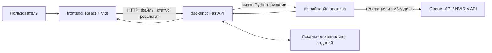

# ИИ-агент «Анализ организационной структуры и функционала»

Прототип для сотрудников, которые проверяют документы **до и после реорганизации**. Он помогает увидеть, какие подразделения изменились, куда перешли функции, где возможны потери, дублирование и конфликты интересов. Выводы сопровождаются ссылками на документы и требуют проверки ответственным сотрудником.

## Что реализовано

- Загрузка документов DOCX, PDF и XLSX для сторон «до» и «после», фоновый запуск анализа, просмотр прогресса и результата.
- Сравнение извлечённого текста двух редакций с выделением добавлений и удалений; просмотр подразделений, функций, рисков и диаграммы перемещения функций (Sankey). По ссылке «Источник» открывается пункт документа с цитатой.
- Python-пакет `ai/`: разбор документов, сопоставление пунктов, подразделений и функций, поиск возможных потерь, дублирования и конфликтов по правилам разделения обязанностей, проверка цитат, агент-критик и формирование заключения.
- FastAPI: хранение заданий и результатов, история анализов, API для подтверждения или отклонения вывода сотрудником и выгрузка служебной записки DOCX. **История и проверка выводов человеком реализованы в API, но пока не выведены в веб-интерфейс.**

## Как работает решение

1. Пользователь загружает документы «до» и «после». Веб-интерфейс отправляет их в FastAPI.
2. Backend сохраняет файлы, запускает задачу в фоне и отдаёт статус. Пакет `ai` разбирает документы, выделяет пункты, сопоставляет структуру и функции, формирует кандидатов на риски и проверяет подтверждающие цитаты. Агент-критик пытается опровергнуть найденные риски.
3. Интерфейс показывает сравнение текста, изменения подразделений, таблицу функций, диаграмму переходов, выводы и источники. Backend может сформировать DOCX-отчёт. Решение сотрудника по выводу можно передать через API; заключение после этого пересобирается.



Папки: [`frontend/`](frontend/README.md) — интерфейс; [`backend/`](backend/README.md) — HTTP API, задания и экспорт; [`ai/`](ai/README.md) — анализ; [`shared/api.md`](shared/api.md) — общий контракт. Подробная схема и исходная постановка находятся в [`ARCHITECTURE.md`](ARCHITECTURE.md); при расхождении описания с кодом ориентируйтесь на текущую реализацию и API-контракт.

## Технологии и интеграции

| Компонент | Используется |
|---|---|
| Интерфейс | React, TypeScript, Vite, Tailwind CSS и CSS |
| Сервер | Python, FastAPI, Pydantic, Uvicorn, `python-multipart`, `python-docx` |
| Анализ | Python, Pydantic, `python-docx`, PyMuPDF, `openpyxl`, RapidFuzz, NumPy, PyYAML |
| AI API | OpenAI SDK; генерация через OpenAI или NVIDIA API, эмбеддинги через OpenAI |

В шаблоне [`ai/.env.example`](ai/.env.example) указаны модели по умолчанию: `gpt-5.4-mini`, `gpt-5.4` и `text-embedding-3-small`. Доступ к ним зависит от ваших ключей и аккаунта. При использовании NVIDIA для генерации ключ OpenAI всё равно нужен для эмбеддингов. Анализ отправляет содержимое документов внешнему AI-провайдеру.

## Установка и запуск

Нужны **Python 3.11+**, **Node.js 20 начиная с 20.19 либо 22.12+** и npm (требование установленного Vite). Команды ниже приведены для Bash из корня клонированного репозитория. Для PowerShell см. инструкции в [`backend/README.md`](backend/README.md) и [`ai/README.md`](ai/README.md).

### 1. Настройка AI

Из корня репозитория создайте `ai/.env`:

```bash
cp ai/.env.example ai/.env
```

Укажите в нём ключи и доступные модели. Для OpenAI нужен `OPENAI_API_KEY`. При `LLM_PROVIDER=nvidia` дополнительно нужны `NVIDIA_API_KEY` и `NVIDIA_MODEL`; `OPENAI_API_KEY` также нужен для эмбеддингов. Секреты храните только в локальных `.env`.

### 2. Backend

```bash
cd backend
python3.11 -m venv .venv
source .venv/bin/activate
python -m pip install -r requirements.txt
cp .env.example .env
```

`requirements.txt` устанавливает соседний пакет `ai/`. В `backend/.env` укажите:

```dotenv
AI_MOCK=false
```

Запустите сервер:

```bash
python -m uvicorn app.main:app --reload --port 8000
```

API будет доступен на <http://localhost:8000/docs>, проверка сервера — <http://localhost:8000/health>.

### 3. Frontend во втором терминале

```bash
cd frontend
npm ci
cp .env.example .env
```

Для подключения к запущенному backend укажите в `frontend/.env`:

```dotenv
VITE_USE_MOCKS=false
VITE_API_URL=http://localhost:8000
```

Затем запустите:

```bash
npm run dev
```

Откройте <http://localhost:5173>.

## Как проверить решение

После запуска по шагам 1–3 проверьте ответ `{"status":"ok"}` на <http://localhost:8000/health>. В интерфейсе загрузите пару обезличенных документов из [`samples/before/`](samples/before/) и [`samples/after/`](samples/after/) и запустите анализ. Дождитесь статуса `done`, проверьте сравнение текста, подразделения, функции, риски, ссылки «Источник» и выгрузите DOCX-отчёт. Загружать нужно по одному файлу на сторону: текущий веб-интерфейс ограничен одной парой, хотя backend принимает несколько файлов.

Историю и проверку вывода сотрудником можно проверить через <http://localhost:8000/docs>: `GET /api/analyses`, затем `PATCH /api/analyses/{id}/findings/{finding_id}` с телом `{"status":"accepted"}`. Автоматические проверки модулей описаны в README соответствующих папок.

## Данные и интеграции

- В репозитории есть обезличенные DOCX редакций 8 и 9 в [`samples/`](samples/), которые можно использовать для проверки анализа.
- Backend сохраняет задания, исходные файлы, статусы и результаты в локальном `backend/storage/`. Реальный AI-режим обращается к OpenAI API или NVIDIA API для генерации и к OpenAI API для эмбеддингов; ответы модели кэшируются локально в `ai/.cache/` по умолчанию. Другие внешние наборы данных или интеграции в текущем коде не подключены.

## Ограничения

- Для анализа загруженных файлов необходимы `AI_MOCK=false`, настроенные ключи и доступ к внешним AI API.
- PDF без текстового слоя не распознаются: OCR не реализован. Сравнение текста не сохраняет исходное оформление Word, PDF или Excel.
- История анализов и проверка выводов сотрудником доступны через API, но не через текущий интерфейс. Чат с документами указан в контракте как планируемый и не реализован.
- Результаты носят рекомендательный характер. Проверка цитаты подтверждает её наличие в документе, но интерпретацию вывода должен проверить сотрудник.

## Развёрнутая версия

Публичная ссылка на развёрнутое приложение в текущем репозитории не указана. Для проверки используйте локальный запуск выше.
