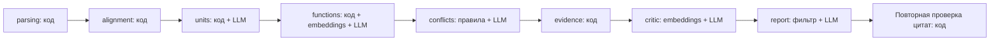

# AI: сравнение структуры и функций до/после

## Что это

Python-пакет сравнивает положения до и после реорганизации: подразделения, функции, возможные потери, дублирование и конфликты интересов. Бэкенд импортирует `run_analysis`; результат — `AnalysisResult` по [контракту](../shared/api.md) с цитатами, redline, потоками Sankey и заключением.

## Быстрый старт

Python 3.11+, PowerShell, из корня репозитория:

```powershell
cd ai
python -m venv .venv
.\.venv\Scripts\Activate.ps1
python -m pip install -e ".[dev]"
Copy-Item .env.example .env
$env:PYTHONUTF8 = "1"
```

Заполните ключи и настройки в `.env`; файл загружается из папки `ai/`. Затем реальный анализ samples (обращается к API и расходует кредиты):

```powershell
python -m ai.cli --before "../samples/before/*.docx" --after "../samples/after/*.docx" --out result.json
```

CLI раскрывает маски сам, печатает прогресс, расход токенов и сохраняет JSON в UTF-8. Поддерживаются DOCX, PDF с текстовым слоем, XLSX/XLSM; OCR нет.

Для демо без ключей и сети используйте готовый [мок](../mocks/result.json). Пересборка вручную размеченного мока из samples:

```powershell
python scripts/build_mock.py
```

## Переменные окружения

Имена соответствуют [.env.example](.env.example); значения задаются локально.

| Имя | Назначение |
|---|---|
| `LLM_PROVIDER` | Выбор провайдера генерации: OpenAI или NVIDIA |
| `OPENAI_API_KEY` | Ключ для генерации OpenAI и эмбеддингов |
| `NVIDIA_API_KEY` | Ключ генерации NVIDIA |
| `OPENAI_MODEL` | Быстрая модель извлечения и классификации |
| `OPENAI_MODEL_STRONG` | Сильная модель сопоставления, проверки рисков и заключения |
| `OPENAI_EMBED_MODEL` | Модель эмбеддингов для поиска функций и контр-аргументов |
| `NVIDIA_MODEL` | Модель при выборе NVIDIA |
| `AI_CACHE_DIR` | Дисковый кэш; относительный путь считается от папки `ai/` |

В текущем шаблоне провайдер — `openai`, быстрая модель — `gpt-5.4-mini`, сильная — `gpt-5.4`, эмбеддинги — `text-embedding-3-small`. Для NVIDIA установите `LLM_PROVIDER=nvidia`, заполните ключ и модель NVIDIA; эмбеддинги всё равно используют OpenAI, поэтому его ключ также нужен. Полное совпадение входа, модели и промпта позволяет повторно использовать кэш; новые запросы требуют API.

## API / интерфейс для бэкенда

```python
from pathlib import Path
from ai.pipeline import run_analysis

result = run_analysis(
    before_files=sorted(Path("../samples/before").glob("*.docx")),
    after_files=sorted(Path("../samples/after").glob("*.docx")),
    on_progress=lambda step, progress: print(step, progress),
)
payload = result.model_dump(mode="json")
# payload: units, unit_changes, function_mappings, findings,
# rejected_findings, documents, alignments, flows, categories, conclusion_md, meta
```

После того как сотрудник принял или отклонил вывод (`Finding.review`), бэкенд пересобирает заключение:
`from ai.report import rebuild_conclusion; result.conclusion_md = rebuild_conclusion(result)` — решение человека важнее вердикта критика.

Пример полного ответа — [mocks/result.json](../mocks/result.json). Вызов синхронный; бэкенду следует выполнять его в фоновой задаче/потоке. Пути примера считаются от папки `ai/`.

`on_progress(step: str, progress: float)` получает начала шагов из `pipeline.STEPS`:

| Шаг | Прогресс |
|---|---:|
| parsing | 0.00 |
| alignment | 0.05 |
| units | 0.10 |
| functions | 0.30 |
| conflicts | 0.60 |
| evidence | 0.70 |
| critic | 0.75 |
| report | 0.90 |

По завершении вызывается `on_progress("report", 1.0)`.

## Пайплайн



Парсер создаёт `clause_id`; `Ctx.evidence` отбрасывает ссылки на отсутствующие документы и пункты. `evidence.py` проверяет нормализованную цитату в пункте с подпунктами, допускает нечёткое совпадение длинных цитат и исправляет ссылку, если цитата найдена в другом пункте.

Критик пытается опровергнуть каждый риск типа `function_loss`, `duplication`, `conflict_of_interest`, ищет контр-цитаты и ставит `upheld`/`uncertain`/`refuted`; структурные выводы сейчас не проходят этот шаг. Опровергнутые выводы попадают в `rejected_findings`, опровергнутые потери корректируют сопоставления и потоки. В заключение допускается риск хотя бы с одной проверенной цитатой и без `refuted`; проверка цитаты подтверждает источник, но не доказывает интерпретацию, поэтому спорные выводы требуют проверки человеком.

## Каталог и промпты

[ai/catalog/functions.yaml](ai/catalog/functions.yaml) — категории функций: универсальные (продажи, закупки, приёмка, склад, инвентаризация, логистика, деньги, учёт, клиенты, ИТ, право…) и специализированные для внутреннего аудита. Типовые обязанности руководителя (`management`, `staff_development`) исключаются из поиска потерь и дублей. [ai/catalog/sod_rules.yaml](ai/catalog/sod_rules.yaml) — правила разделения обязанностей (SoD): универсальные (выбор поставщика + приёмка, хранение + инвентаризация, деньги + их учёт, продажи + скидки) и аудиторские (методология + контроль её качества и др.). Каталоги расширяются правкой YAML без изменения кода. Совпадение категорий создаёт кандидата, который затем проверяет LLM по тексту.

| Файл в `ai/prompts/` | Шаг | Что делает |
|---|---|---|
| `units_extract.md` | units | Извлекает единицы, подчинение, должности и цитаты |
| `units_match.md` | units | Сопоставляет единицы, не сопоставленные кодом |
| `functions_extract.md` | functions | Извлекает функции и присваивает категории |
| `functions_match.md` | functions | Проверяет соответствие функций среди кандидатов |
| `duplicates_verify.md` | functions | Проверяет дубли разных подразделений |
| `conflicts_verify.md` | conflicts | Проверяет кандидатов по SoD-правилам |
| `critic.md` | critic | Ищет опровержение риска с контр-цитатами |
| `report.md` | report | Составляет заключение из переданных результатов |

## Статус

Работают парсинг, выравнивание, извлечение/сопоставление единиц и функций, поиск рисков, проверка цитат, критик, заключение и CLI. Мок — отдельный вручную подготовленный результат, а не результат LLM; его `lost` обозначает возможный пробел закрепления ответственности ДККМ при сохранении функции у других руководителей.

Ограничения: автоматического переключения провайдера или возврата мока при сетевой ошибке сейчас нет — демо-результат должен выбрать вызывающий код. Нечёткое выравнивание эвристическое; при нескольких документах пары выбираются по похожести имён. Доля проверенных цитат не измеряет полноту или истинность всех выводов. Известное расхождение с golden описано ниже.

## Как проверить

Из папки `ai/`, без API-вызовов:

```powershell
python -m pytest -q
python evals/run_evals.py ../mocks/result.json --strict
python evals/run_evals.py result.json --golden evals/golden_r8_r9.json --strict
```

Последняя команда требует уже сохранённого результата. Eval загружает `AnalysisResult` и не запускает анализ. Без `--strict` непройденные факты только печатаются; с ним код выхода — 1 при пропуске любого факта, 0 при полном совпадении; ошибка входного файла даёт 2. Путь к golden по умолчанию определяется относительно скрипта.

## Качество

Проверка 2026-09-23: **45 тестов прошли**; реальный результат — `ai/result.json` после `python -m ai.cli` на `samples/`.

| Метрика | Мок | Реальный результат |
|---|---:|---:|
| Изменения подразделений | 4/4 | 4/4 |
| Выравнивания | 9/9 | 9/9 |
| Golden-выводы | 1/1 | 1/1 |
| Всего golden-фактов | **14/14** | **14/14** |
| Проверенные Evidence в findings, включая контр-цитаты | 20/20 (100%) | 42/42 (100%) |
| Отклонено критиком | 1 | 3 |
| structure_change | 1 | 4 |
| function_loss | 1 | 0 |
| duplication | 1 | 3 |
| conflict_of_interest | 1 | 1 |

Реальный результат `--strict` проходит (код 0). Ранее вывод о разделении направления ВА не ссылался на п. 3.4 — теперь выводы об изменениях структуры дополняются ссылками на пункты, где каждая единица названа в составе структуры.

Для новой единицы «после» eval принимает `created`, `split`, `transformed`, `merged`; `preserved` и `renamed` различает. Выравнивания проверяются по точной тройке номеров и статуса. Golden-вывод должен одновременно содержать все заданные аббревиатуры и подходящую собственную ссылку; rejected-выводы не засчитываются. Метрика Evidence считает сохранённые флаги `verified`, включая контр-цитаты оставленных выводов, без повторной проверки текста; без ссылок выводится «нет ссылок».

## Стоимость

Замер «холодного» прогона (пустой кэш) на ред. 8 → 9, 2026-09-23 — CLI печатает эти цифры в конце каждого запуска:

| Модель | Вызовов | Токенов вход | Токенов выход |
|---|---:|---:|---:|
| `gpt-5.4-mini` (извлечение) | 5 | ~100 000 | ~12 000 |
| `gpt-5.4` (сопоставление, проверки, критик, заключение) | 17 | ~51 000 | ~6 500 |
| `text-embedding-3-small` | 19 | ~74 000 | — |

Время: **~2 мин** холодный прогон, **< 1 с** повторный (всё из кэша `AI_CACHE_DIR`). Точную сумму смотрите в Usage кабинета OpenAI: при таком расходе токенов бюджета хакатона хватает на много прогонов. Для демо заранее прогоните контрольный комплект — тогда на защите результат придёт из кэша мгновенно.
